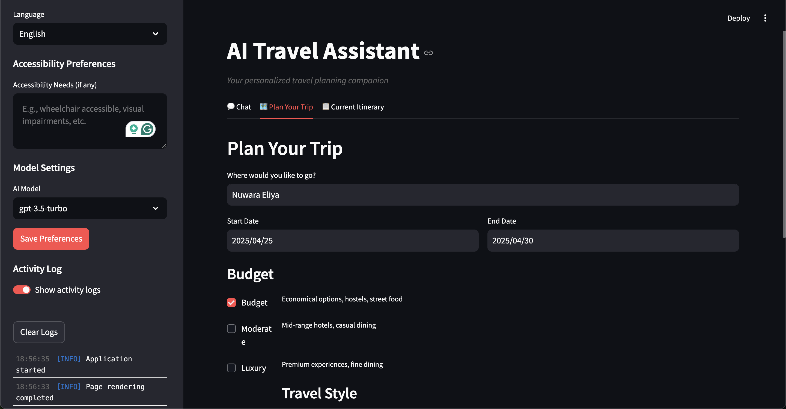

# AI Travel Assistant

AI-powered tool that helps create personalized travel itineraries based on your preferences.



## Key Features

- Chat naturally with the AI about your travel plans
- Get personalized day-by-day travel itineraries
- Support for multiple languages
- Accessibility-friendly recommendations
- Budget optimization tools
- Local insights for attractions and events
- Feedback system to improve recommendations

## Quick Start

1. **Clone and setup:**

   ```bash
   pip install -r requirements.txt
   ```

2. **Add your API key:**
   Create a `.env` file in the project root with:

   ```
   OPENAI_API_KEY=your_api_key_here
   ```

3. **Launch the app:**
   ```bash
   streamlit run app.py
   ```
   Then open http://localhost:8501 in your browser.

## Project Organization

- `/agents` - AI conversation and recommendation modules
- `/data` - Database and cache storage
- `/models` - Database connection management
- `/utils` - API utilities and prompt templates

## Requirements

- Python 3.8+
- OpenAI API key
- Internet connection

## How It Works

The application uses three specialized components:

- **Conversation Agent**: Handles natural dialog with users
- **Recommendation Agent**: Builds customized travel plans
- **Context Agent**: Manages language and accessibility preferences

All components use OpenAI's GPT models with efficient caching to minimize API costs.
